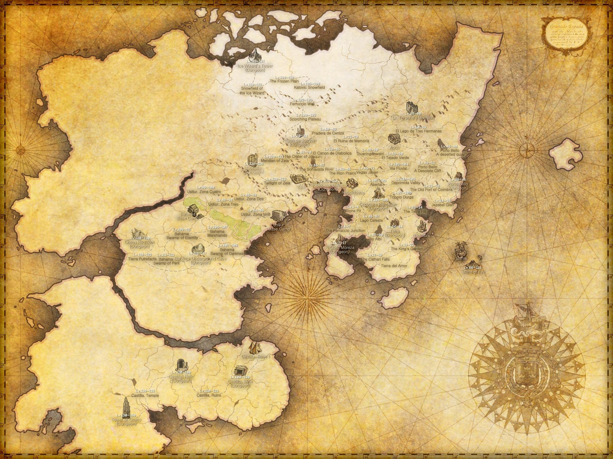
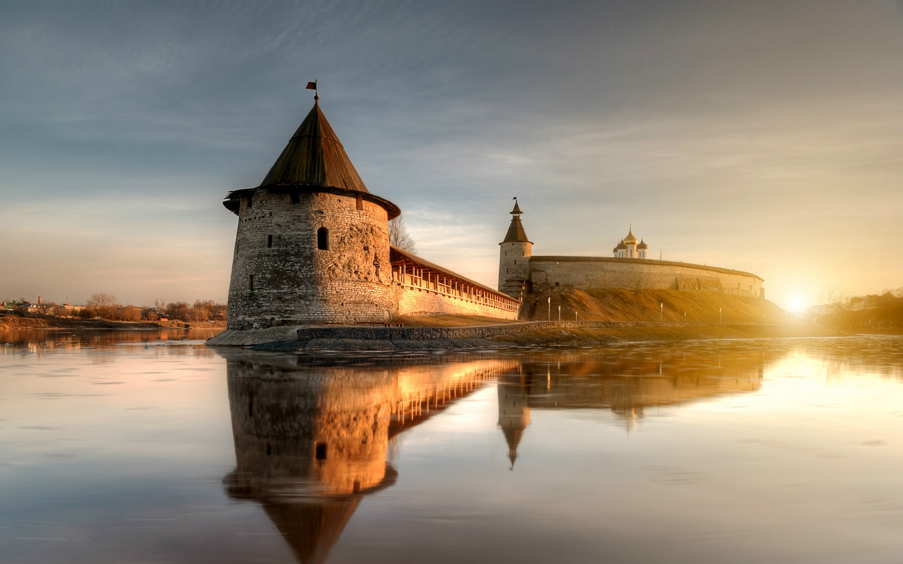
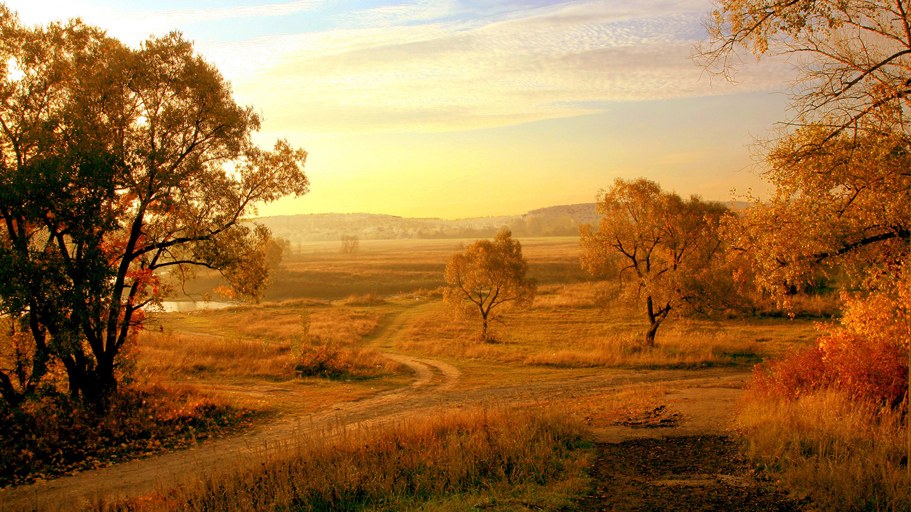
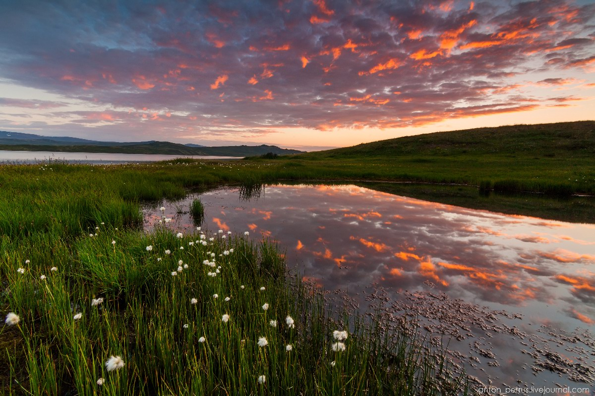
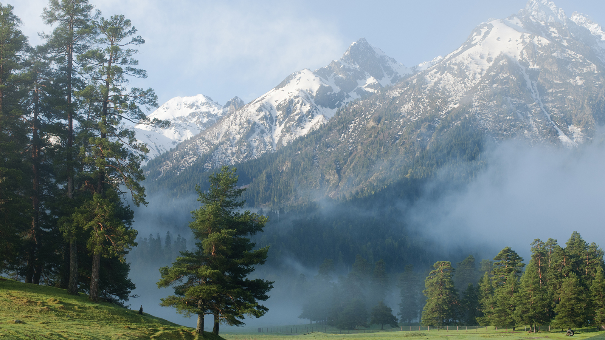
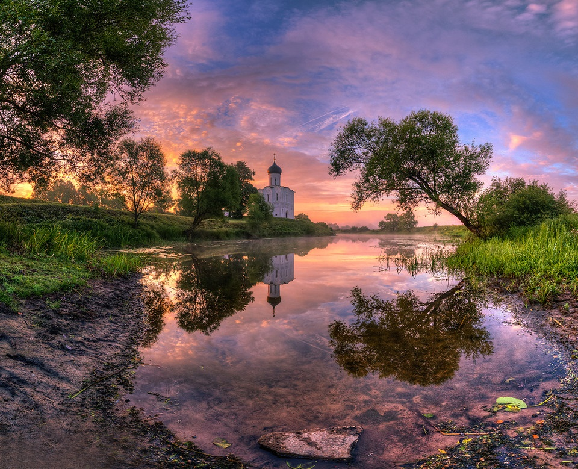
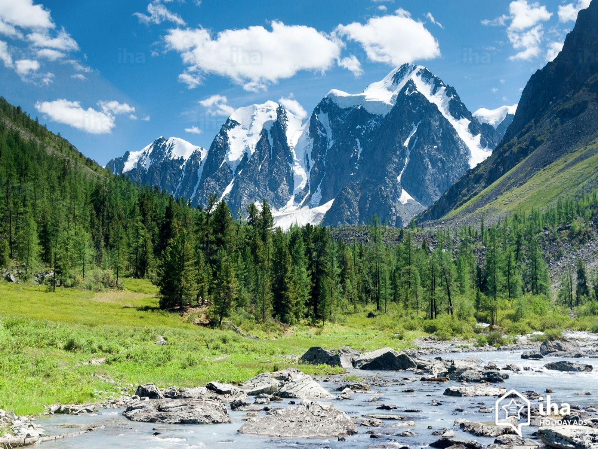
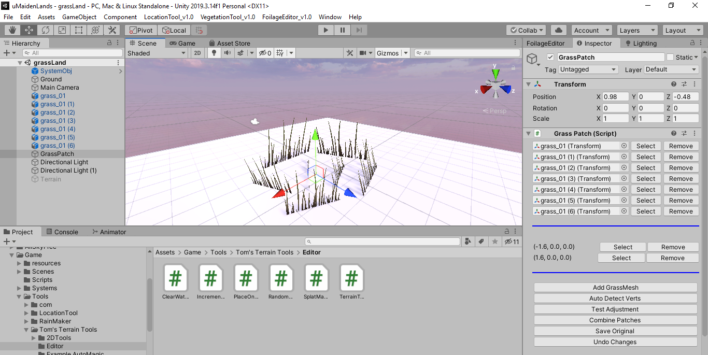
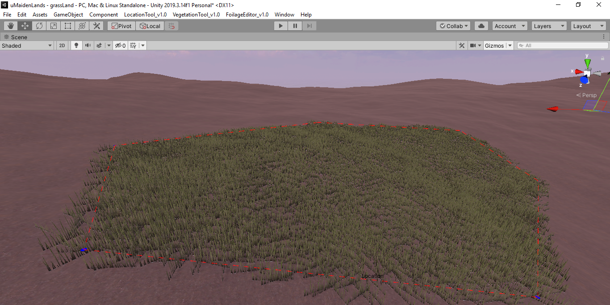
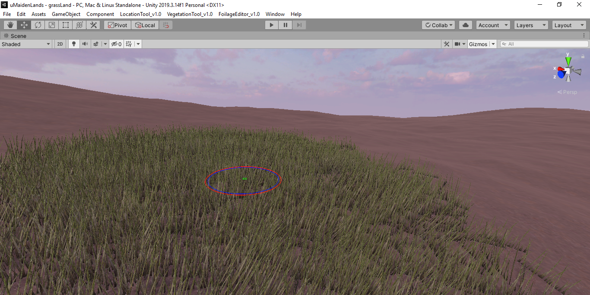

# MaidenLands
# Open world, open source, medieval fantasy Role Playing Game

## About
This is the primary repository for an "open world, open source" role playing game.
The game will be playable from third person point of view.
The basic motivation behind this project is to allow people to be able to create their own stories, quests or levels such as  towns, villages, places or castles in a much larger already developed world landscape/terrain, users will be able to import their own characters, creatures or 3d models, provided that the  art style, theme of the world is kept constant.
Developers or gamers will be provided with especially developed tools that will allow them to develop their own stories, quests, levels or mods.
For those who just want to enjoy the world will be able to download the game for free. 
Since the game is open source, funding for the development of this game will be done primarily through donations and revenue generated through crowd funding.

*__Please note that this is the first iteration of this document, mistakes or incomplete details are expected__*.
*__Give your feedback at ObaidurRehman164@gmail.com or like the facebook page*__

## Background and Story
The game will be set in far away "Maiden Land", with Nordic villages and towns to the north of it and Eastern caucasian ethnic populations in the middle lands.
The world will draw inspirations in terms costumes/clothing and life style/living from late medieval european civilizations.
"Maiden Land" is medieval fantasy, apart from humans it has creatures and beasts living in it's vast wilderness, some live in communities and other independently.
These creatures and beasts are powerful and dangerous beyond the strength of any human, so humans to counter these have evolved ranged weapon technologies including bows, 
Cross bows and gun powder.

## Goals
1. The goal of this project is a create a AAA standard opensource medieval style "Role Playing Game".
2. To allow non technical people/artists to bring their imaginations to life by creating their own stories, quests, dialogues and levels such as villages and towns in a already crafted beautiful world by providing them with high quality easy to use tools.
3. To allow people to enjoy stories, quests, levels created by other people.
4. To allow artists to demostrate/showcase their artistic skills such as
 - animations
 - rigging
 - environment art and
 - character art, in a beautiful world where they can bring and visualize their creations to life with intelligent NPCs, dynamic day night cycles, dynamic weather conditions etc.
 
## Plan of Action
Since this project is open source ***project development plan of action*** should be available to all contributors, and development work should be trackable for all personnel
invloved in development. This is an overview of development steps in order of their execution, however the timeline for development stages are described below in a seperate section of their own in "MileStones and initial world building".

1. **Phase-1** 
- Development of a foilage / vegetation system. (already in progress)
- hiring concept artists for creating an art direction for "MaidenLands".

2. **Phase-2** 
- Developing AI Systems, decision making systems for non player characters

## How will this help you ?
Even if you are not interested in the world of this game, you can still benefit from it's development.

1. For freelancers, artists and less experienced programmers, a mature/stable and tested unity framework for various game systems such as
 - save/load system
 - character inventory/crafting/item loot system
 - character stats system
 - camera systems( e.g collision handling, proper physics )
 - dialogue system
 - skill/reward system
 - AI algorithms and
 - much more
will be created, so they won't have to reinvent the wheel everytime on their next freelance project hence increasing productivity.
2. Start-ups and smaller companies with less technical staff working on their next game will be able to cut-short tonnes of precious development time and by just cloning this repository and get a mature framework being mentained by open source community, thus saving time and budget.
3. If nothing else matters for you, you can still bring your imaginations to life by creating your own stories, quests, characters, villages and towns or other's and *get lost in there for a while.*
4. Developers will get their part of budget, collected through donations and crowd-funding, depending upon the amount of contributions they will made.
5. Users who will create stories, quests, levels(towns, villages etc) and assets(environment art, animations, characters) will be able to sell them on through market and merchants in the game world.

## Art style & Concept art 
1. The game will have realistic art style in terms of terrain, vegetation, characters and other assets, the best example for this game's *__art style, lightning, mood and atmosphere is Remedy Entertainment's Alan wake.__*
Although this game is medieval themed and open world opposed to Alan wake however we can still use the art style, mood, lightning refrence of Alan wake, *__Alan wake provides a good exagratted day, evening, night time lightning and mood examples.__*

        

2. Initial vegetation assets, terrain/landscapes will be created by development team.
3. Officially art assets such as 3d models for villages, towns, castles, props, animations will be purchased from unity asset store publisher DEXSOFT-Games https://assetstore.unity.com/publishers/15, asset packs such as.

 - https://assetstore.unity.com/packages/3d/environments/historic/medieval-castle-model-7601.
 - https://assetstore.unity.com/packages/3d/environments/fantasy/viking-village-13921.

4. Programming will be completly done from scratch by the development team.
5. The world of "Maiden Land" is divided into two continents, and will have diverse landscapes features ranging from vast grass lands to snow covered montains, rivers and dense forests. In order to keep things constant and in harmony in terms of vegetation that grows in this land and physical features, the landscape of Russian is chosen.

     
  
## Gameplay and game mechanics overview
1. The game is an open world RPG(Role playing game) played from third person point of view.
2. The main focus of the game world will not necessary be combat instead it will be story telling, immersion in the game world,
beautiful level designs and vistas however combat will still be an essential part of this game.
3. Game will feature limited but well crafted game play mechanics such as.
- *inventory system*
- *crafting system*
- *branching dilogue system*
- *branching stories*
- *dynamic day/night cycle*
- *intelligent NPCs*
- *exploration*
- *various interactions in game world*

## Technical details overview
## World
1. The game will have a 32 square km world with various terrain/landscape features such as mountains, rivers, grass lands.
2. Dynamic day time and weather system.
3. Speed tree shaders provided by default by unity will be used for vegetation shaders.
4. Landscape will be procedurally generated using "World machine" and later fine detailed using unity's new terrain tools 
and terrain brushes.
5. A terrain system similar to Colormap Ultra Terrain Shader 4.0 will be used for terrain shading available on unity asset store, will be developed
for terrain shading.
https://assetstore.unity.com/packages/tools/terrain/colormap-ultra-terrain-shader-4-0-67260#description.
6. A procedural foilage distribution system will be developed for procedural vegetation scattering based on the following paper.
https://www.researchgate.net/publication/303973921_Procedural_Generation_of_Mediterranean_Environments.
You are welcomed to read the reserch paper.
7. Apart from procedural distribution of vegetation, custom terrain brushes and tools for foilage paiting on terrain will also be
developed.
8. Other useful and important tools such as road system for rapidly creation road/paths using splines,
object placement along a spline such as  fences will also be developed for production to make level design and world building as fast as
possible.

 ***a glimpse of tools that are being developed are for vegetation and foilage are as follows, they are inspired by cryengine foilage tools, and use clumps or
 patches for grass and ground cover( with proper height and mesh adjustment according to normal of terrain, topology and surface below) including bushes with the exception of trees***.
 ***Some of the tools being developed are***
 1. *Grass patch system.*
 2. *Rule based Geo paint tool (allows painting foilage or meshes such as debris on terrain as well as other meshes).*
 3. *Foilage area Tool, allow defining a fixed boundary area to grow or remove foilage into*
 4. *Splat map texturing tools for up to 8 textures.*
 5. *A foilage distribution system for entire terrain, based on paper mentioned above.*
 
 *although these tools are included in this repository, please keep in mind, that these tools are are not perfect yet, they are young and rough and need further,
 improvements, which is something I am working on*
 
 
 
 
 
 *video demostrations of above mentioned tools*
 
 1. https://www.youtube.com/watch?v=hBmHCbm6R_s.
 2. https://www.youtube.com/watch?v=zgq6685nBd0.
 3. https://www.youtube.com/watch?v=TtYiDVQB7jc.
 
## AI
1. GOAP or "goal oriented action planning" algorithm will be used for Non player characters(NPCs), decision making, the actual implementation of algorithm will be based on GOAP algorithm mentioned in this book
https://www.amazon.com/Programming-Example-Wordware-Developers-Library/dp/1556220782.
2. Unity builtin "NavMesh" will be used for NPC navigation.
3. AI agents/NPCs behavious will be divided into two categories.
  - Low level behaviours such as seek, flee, chase, hide, chat, gather, dialogue etc.
  - Low level behaviours are then grouped/arranged or executed in sequence to create more complex behaviours such as **go to forest and 
  **gather wood**, is a sequential execution of seek and gather wood, however more complex behaviours are also possible.
4. For AI/NPC sensory system(senses) a robust open source sensory system "UnitySensorySystem" will be used, however in order to 
integerate the "sensory system" into this project, the "sensory system" will require some minor modifications. The link to 
mentioned "sensory system"
https://github.com/ntk4/UnitySensorySystem.
5. Apart from above mentioned AI systems, custom systems are also created, info I have already created one, I have 
named it **_Location tool_**. The **_Location tool_** apart from other uses which I will mention it their respective categories, allows
creation of areas or location in a game world. With the help of this tool any location can be marked/converted to a location, the newly
created location is then be decorated with different useful properties such as the location's
- name
- location in game world
- important destionations in that location etc etc.
In the context of AI this information provided by **_Location tool_** is very important for example
- AI agents can be made aware of their current location in the game world e.g near **_old bear's inn_** or inside **_castle black_**.
- AI agents can poll locations during decision making phase, this is very important since more complex behaviours can be created
such as **_go to castle black_** or **_go to blacksmith and forge a sword_**.
This was just an overview of **_Location tool_**, however this tool is quite complex and it is not limited just to AI, more about this 
tool will be mentioned it their respective categories.

## Other
1. A graph system implementation will be used for a branching dilalogue, story as well as for quest editor, the implementation of graphs and other graphs related search algorithms will be based upon graphs implementation mentioned in this book
https://www.amazon.com/Programming-Example-Wordware-Developers-Library/dp/1556220782.

## Quest Editor 
We have big expectations in terms of "quests" for "Maiden Lands".
"__The quests will be 100% non-linear and can be completed in any more then one way__", quests will drive the story forward.
(More info comming soon).

## Timeline
Plan to finish off complete coding part of the game and world building is about 6 months, starting from **6/1/2020**, provided that the desired funding for the project is recieved. It will include 
1. Tools a fully detailed 32 square landscape with varing landscape features and vegetation will be available to general community.
2. Complete tools for gamers, level designers and artists to start populating the world, create stories, quests, towns, villages etc.
3. Game play mechanics.
4. Player mechanics.
5. World dynamics.

## MileStones and initial world building
1. The initial world will be built as soon as possible, it will be completly working game with all the necessary systems, it will include the following

As you can see from the above repo I have briefly touched most important game system already including AI and Foilage system however in order to make then performance friendly 
and optimized it will take one month per each system.

- **_(Month 1)_---> vegetation and foilage system** 
since the game take place in vast open landscapes, vegetation and foilage system will be the heart of all systems. Most of the basic tools included in vegetation 
system are almost complete however in order to make the vegetation system performance friendly as well, it will take time, I plan to give it a full complete month,
including writing all the manuals and making video tutorials. 

- **_(Month 2)_---> player mechanics such as** 
  - character controllers
  - inventory system
  - crafting system
  - item loot system
  - dialogue system
  
- **_(Month 3)_---> developer tools to allow gamers/other developers to rapidly start creating in game content, initial developer tools will be**
  - quest editor
  - story editor
  - tools to create and design levels such villages and towns
  - tools to add AI 
  
- **_(Month 4)_---> a 32 km square playable landscape/terrain with all details(from grasses, trees, rocks, rivers, mountains etc)**

- **_(Month 5)_---> game mechanics such as**
  - dynamic time of day
  - dynamic weather system
  - save/load 
  - etc
  
- **_(Month 6)_---> video tutorials & fine tuning previous steps**
  - video demostration by developers of various tools
  
- **_(Month 7)_---> fine tuning previous steps**
  
- a fully working user interface
  
## Donations / Crowd funding
I have past 7 to 8 months working full time on this ambitious project of mine, I worked on every single core aspect mostly technicals such as developing and making ready
the tool set to be used by other developers, however I have to pay for other aspects which are out of my domain such as concept art and art direction.
This project will also cost some part time developers as well, 

*Initially I would require a humble amount of **1000$ US Dollars**, donations can be made using direct bank deposit or by becoming a patreon, both will earn rewards.*
*Benefits of contributing will be*

1. Access to Proprietary tools ( AI, Story editor and Quest editor ).
2. On demand tools.
3. On demand game mechanics.

**using western union**
1. National ID card number: 32203-0191179-8.
2. Mobile/Cell phone number: +923430285008.

**donations can be made by direct bank deposists**
1. Account number: PK69BKIP0303400180820001.
2. Swift code: BKIPPKKA.

**or by becoming a patreon**
https://www.patreon.com/MaidenLands

**a kick starter campaign (comming in first week of July)**

*for any query / question contact me directly*

Contacts.
1. ObaidurRehman164@gmail.com.
2. https://www.facebook.com/obaid.rehman.1044/.
3. whatsapp +923430285008 
